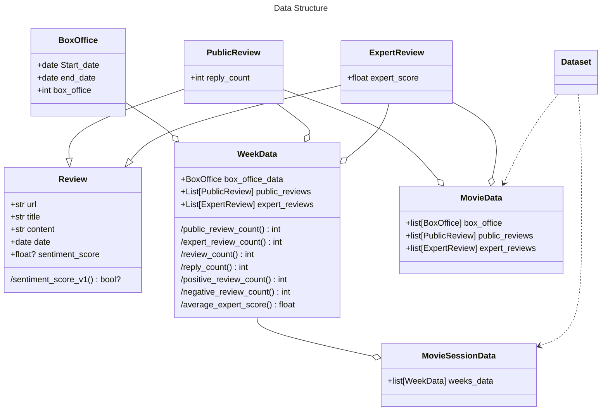
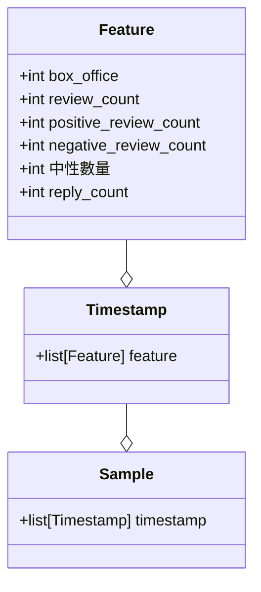

```python
positive = len(review for review in public_reviews if review.sentiment_score > 0)
negative =len(review for review in public_reviews if review.sentiment_score < 0)

reply_count = sum(review.reply_count for review in public_reviews)

```
sentiment_score
- v1
    sentiment model
    0 < score < 1
    (score > 0.5) => true
    (score <= 0.5) => false
- v2 (SKEP)
    正面or負面 + 預測準確率 (0~1)
    正面 = 1、負面 = -1
    (1 or -1) x 準確率
    1~0 、 -1 ~ 0 => -1 ~ 1
    (score > 0) => true
    (score <= 0) => false
    if 準確率 = 0
